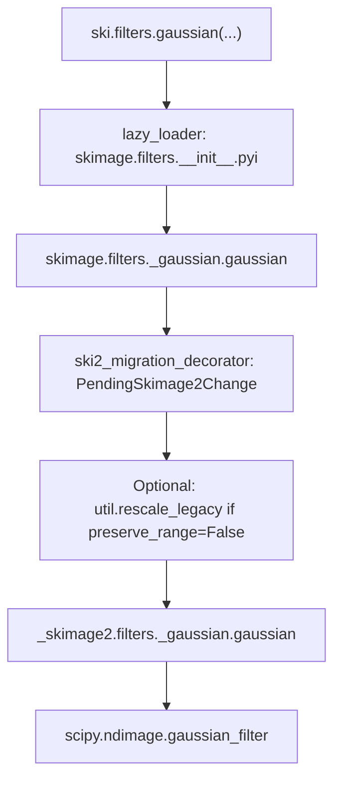

# scikit-image developer onboarding

**Audience:** New developers working on this repository.
**Last reviewed:** 2026-07-27

This is a short baseline before your first contribution. **Policy and full detail live in [CONTRIBUTING.md](CONTRIBUTING.md)** — treat that file as the source of truth; this page summarizes and links.

---

## What this project is

**scikit-image** (`skimage`) is a BSD-licensed Python library for image processing and computer vision, part of the [Scientific Python](https://scientific-python.org/) ecosystem (NumPy, SciPy, Matplotlib).

- **Users import:** `import skimage as ski`
- **Python:** 3.12+ ([pyproject.toml](pyproject.toml))
- **Docs:** [https://scikit-image.org/docs/stable/](https://scikit-image.org/docs/stable/)
- **Developer forum:** [discuss.scientific-python.org — skimage](https://discuss.scientific-python.org/c/contributor/skimage)
- **Chat:** [Zulip](https://skimage.zulipchat.com/)

---

## Repository layout

| Path                                                                  | Role                                                            |
| --------------------------------------------------------------------- | --------------------------------------------------------------- |
| [src/\_skimage2/](src/_skimage2/)                                     | **Core implementation** — put new algorithm code here           |
| [src/skimage/](src/skimage/)                                          | **Stable public API** — wrappers, migration shims, re-exports   |
| [src/skimage2/](src/skimage2/)                                        | **Experimental v2 API** (warns on import)                       |
| [tests/skimage/](tests/skimage/) / [tests/skimage2/](tests/skimage2/) | Tests for each API surface                                      |
| [doc/examples/](doc/examples/)                                        | Sphinx-Gallery examples (required for new user-facing features) |

### v2 migration (read once)

The project is moving toward **2.0** without breaking existing `skimage` users. One shared implementation lives in `_skimage2`; `skimage` preserves old behavior via wrappers. Details: [SKIP 4](doc/source/skips/4-transition-to-v2.rst) and the [migration guide](https://scikit-image.org/docs/stable/user_guide/skimage2_migration.html).

**Rule of thumb:** implement in `_skimage2`; wire `skimage` / `skimage2` as needed.

---

## End-to-end trace example

This walkthrough follows **`skimage.filters.gaussian`** — a typical path with lazy loading, a v1 compatibility wrapper, and a SciPy-backed core. It is a good template for “where do I edit?”

### User code

```python
import skimage as ski

filtered = ski.filters.gaussian(image, sigma=1.0, channel_axis=-1)
```

### Flow (overview)



### Step 1 — Resolve `skimage.filters`

Accessing `ski.filters` does not import every filter upfront. The subpackage uses **`lazy_loader`**:

- [src/skimage/filters/**init**.py](src/skimage/filters/__init__.py) calls `lazy_loader.attach_stub`.
- The stub [src/skimage/filters/**init**.pyi](src/skimage/filters/__init__.pyi) maps public names to modules, e.g. `gaussian` → `from ._gaussian import gaussian`.

Only when you first use `gaussian` does Python import [src/skimage/filters/\_gaussian.py](src/skimage/filters/_gaussian.py).

### Step 2 — Stable API wrapper (`skimage`)

The function users call is defined in `skimage`, not copied from scratch. It is wrapped with **`@ski2_migration_decorator`** ([src/skimage/\_migration.py](src/skimage/_migration.py)):

- On each call, a **`PendingSkimage2Change`** warning can fire (silent by default) pointing maintainers and early migrators toward `skimage2.filters.gaussian`.
- The wrapper keeps **v1-only** parameters and behavior — notably **`preserve_range`** (removed in v2).

Relevant logic in the wrapper:

```python
# src/skimage/filters/_gaussian.py (simplified)
if not preserve_range:
    image = ski2.util.rescale_legacy(image)
return ski2.filters.gaussian(
    image, sigma=sigma, mode=mode, cval=cval,
    truncate=truncate, channel_axis=channel_axis, out=out,
)
```

So for default `preserve_range=False`, **`skimage`** rescales the image to legacy float conventions **before** calling the core. **`skimage2`** skips that step (range always preserved in core).

### Step 3 — Core implementation (`_skimage2`)

`ski2.filters.gaussian` is implemented in [src/\_skimage2/filters/\_gaussian.py](src/_skimage2/filters/_gaussian.py):

1. Validate `sigma >= 0`.
2. If `channel_axis` is set, adjust `sigma` so channels are not smoothed together (insert `0` on the channel axis).
3. **`convert_to_float(..., preserve_range=True)`** and cast to a supported float dtype.
4. Validate `out` is floating-point if provided.
5. Delegate to **`scipy.ndimage.gaussian_filter`**.

This is where you change algorithm behavior, add validation, or adjust dtype handling. The installed package exposes `_skimage2` internally; public v2 users import **`skimage2`**, which re-exports `_skimage2` via `__getattr__` ([src/skimage2/**init**.py](src/skimage2/__init__.py)).

### Step 4 — External dependency

No Cython on this path: the heavy work is in **SciPy**. Many other functions follow the same pattern (pure Python + NumPy/SciPy). Hot paths (e.g. connected components in `measure.label`) add a **Cython** layer (`.pyx`) built by **Meson**, still reached through a Python function in `_skimage2`.

### Same function, three entry points

| Call                              | What runs                                                              |
| --------------------------------- | ---------------------------------------------------------------------- |
| `skimage.filters.gaussian(...)`   | Wrapper + optional `rescale_legacy` + `_skimage2` + SciPy              |
| `skimage2.filters.gaussian(...)`  | `_skimage2` + SciPy (experimental import warning on `import skimage2`) |
| `_skimage2.filters.gaussian(...)` | Core only (internal; not the public API you document for users)        |

### Contrast: pass-through API (no wrapper logic)

Not every symbol has a migration wrapper. For example **`skimage.measure.label`** is a thin re-export:

```python
# src/skimage/measure/_label.py
from _skimage2.measure._label import label as label
```

Tracing that call goes straight to [src/\_skimage2/measure/\_label.py](src/_skimage2/measure/_label.py), which may call **`scipy.ndimage.label`** (bool images) or **`label_cython`** in [src/\_skimage2/measure/\_ccomp.pyx](src/_skimage2/measure/_ccomp.pyx) (integer labels).

When exploring a function, open its **`skimage`** module first: if you see only `from _skimage2... import`, the logic is entirely under **`src/_skimage2/`**.

### Tests mirror the stack

- Stable behavior: [tests/skimage/filters/](tests/skimage/filters/) (and doctest examples on `skimage` docstrings).
- Core / v2 behavior: [tests/skimage2/filters/](tests/skimage2/filters/).

Changing `_skimage2` often requires updating **`tests/skimage2/`**; if the **`skimage`** wrapper changes user-visible behavior, update **`tests/skimage/`** as well.

---

## Conventions (high level)

See [CONTRIBUTING.md — Guidelines and Stylistic Guidelines](CONTRIBUTING.md).

- Tests and **NumPy-style docstrings** for all code
- **Gallery example** for new user-facing functionality
- Imports in docs/tests: `import numpy as np`, `import skimage as ski`
- Document arrays as **row / column / plane**, not x/y/z
- Functions should accept **all input dtypes**
- **Relative imports** inside packages (`from .._shared import xyz`)
- **Cython:** release the GIL where possible; expose via a pure Python API

---

## Local setup

Requires C and C++ compilers and Python 3.12+.

```sh
git clone git@github.com:YOURUSER/scikit-image
cd scikit-image
python -m venv ~/envs/skimage-dev && source ~/envs/skimage-dev/bin/activate
pip install -r requirements.txt
spin install -v
pip install pre-commit && pre-commit install
```

Alternative: `conda env create -f environment.yml`, then `spin install -v`. Full steps: [CONTRIBUTING.md — Build environment setup](CONTRIBUTING.md).

---

## Getting started with the Cursor framework

This repository includes a **repo-owned Cursor setup** under [`.cursor/`](.cursor/) — rules, skills, and hooks that guide AI-assisted work without replacing [CONTRIBUTING.md](CONTRIBUTING.md). Humans and agents both start from [AGENTS.md](AGENTS.md) (loaded automatically in Cursor for this workspace).

Maintainers who extend the framework should read [`.cursor/README.md`](.cursor/README.md). The steps below are enough to **use** it on day one.

### How the pieces connect

```text
AGENTS.md (always) → choose persona (Developer / PM / QA)
                   → workflow skills (first PR, pre-PR, tests)
                   → file rules when editing src/ or tests/
                   → security rules + hooks (shell / protected files)
```

| Layer                 | Location                                               | Your takeaway                                       |
| --------------------- | ------------------------------------------------------ | --------------------------------------------------- |
| Routing & layout      | [AGENTS.md](AGENTS.md)                                 | Where code lives, use `spin`, verify before PR      |
| Persona               | [.cursor/rules/persona.mdc](.cursor/rules/persona.mdc) | Pick **one** mode per chat                          |
| Workflows             | [.cursor/skills/](.cursor/skills/)                     | Step-by-step playbooks the agent follows            |
| Edit-time conventions | `skimage-source.mdc` / `skimage-tests.mdc`             | Extra hints when changing `src/` or `tests/`        |
| Enforcement           | [.cursor/hooks/](.cursor/hooks/)                       | Blocks or asks before risky edits or shell commands |

### 1. Open the repo in Cursor

Clone the repo, complete [local setup](#local-setup) (`spin install -v`, `pre-commit install`), then open the **repository root** as the workspace so `AGENTS.md` and `.cursor/` apply.

Project hooks are registered in [`.cursor/hooks.json`](.cursor/hooks.json). You may see **approval prompts** when the agent tries to edit protected paths (for example `AGENTS.md`, `.github/workflows/`, `.cursor/skills/`) or run sensitive shell commands — that is expected.

### 2. Start a chat and choose a persona

In a **new Agent chat**, declare how you are working (the agent will ask once if you do not):

| Persona       | Use when                                     | Skill                                                          |
| ------------- | -------------------------------------------- | -------------------------------------------------------------- |
| **Developer** | Implementing, debugging, first PR            | [persona-developer](.cursor/skills/persona-developer/SKILL.md) |
| **PM**        | Issues, scope, acceptance criteria (no code) | [persona-pm](.cursor/skills/persona-pm/SKILL.md)               |
| **QA**        | Test plans, verification checklists          | [persona-qa](.cursor/skills/persona-qa/SKILL.md)               |

For coding and contributions, say **`Persona: Developer`** (or equivalent). First-PR work **requires** Developer; the agent will not implement until that is set.

### 3. Phrases that route to workflows

You do not need to memorize skill paths — describe intent in natural language:

| You say (examples)                                                              | Agent follows                                                                                                                                                                                                             |
| ------------------------------------------------------------------------------- | ------------------------------------------------------------------------------------------------------------------------------------------------------------------------------------------------------------------------- |
| “Help with my **first contribution** / **first PR** / pick a **starter issue**” | [first-contribution](.cursor/skills/first-contribution/SKILL.md) — prefers [`:beginner: Good first issue`](https://github.com/scikit-image/scikit-image/issues?q=is%3Aopen+label%3A%22%3Abeginner%3A+Good+first+issue%22) |
| “**Validate** my branch / **ready for PR** / pre-PR checks”                     | [pre-pr-gate](.cursor/skills/pre-pr-gate/SKILL.md)                                                                                                                                                                        |
| “**Add tests** for … / improve coverage for …”                                  | [scaffold-test](.cursor/skills/scaffold-test/SKILL.md)                                                                                                                                                                    |

Stay within the issue scope; the skills link to CONTRIBUTING for full policy.

### 4. Pre-PR verification (human or agent)

Before opening a PR, run the same gate the pre-pr-gate skill uses:

```bash
./tools/cursor/validate-contribution.sh
```

That script checks contribution heuristics (e.g. tests paired with `src/` changes, `TODO.txt` when deprecating), **pre-commit** on changed files, then **`spin test --test-modified`**. Options: [tools/cursor/README.md](tools/cursor/README.md).

You can run it yourself or ask the agent to run it after **Persona: Developer** and a “validate before PR” request.

### 5. Policy still applies to you

The framework **does not relax** project rules: review every agent-generated line, disclose AI use in the PR ([AI policy](CONTRIBUTING.md#ai-policy)), and treat [CONTRIBUTING.md](CONTRIBUTING.md) as authoritative if chat advice differs.

---

## Day-to-day commands

Use **`spin`**, not raw `pytest` / `meson`, for builds and tests ([AGENTS.md](AGENTS.md)).

| Task                            | Command                                   |
| ------------------------------- | ----------------------------------------- |
| Run tests (changed subpackages) | `spin test --test-modified`               |
| Run one area                    | `spin test -- tests/skimage/morphology`   |
| Build docs                      | `spin docs`                               |
| Pre-PR check (this repo)        | `./tools/cursor/validate-contribution.sh` |

---

## Guardrails you will hit

| Layer          | What enforces                                                                                        |
| -------------- | ---------------------------------------------------------------------------------------------------- |
| **pre-commit** | Ruff, Ruff format, cython-lint, Prettier (md/rst/yml), requirements sync with `pyproject.toml`       |
| **pytest**     | Warnings treated as errors by default (`filterwarnings = error` in [pyproject.toml](pyproject.toml)) |
| **CI**         | Multi-platform `spin test`, doctests, docs build (`sphinx -W`), docstub, wheels                      |
| **Review**     | Two core approvals for merge; never merge your own PR                                                |

On PRs, CI usually runs **`spin test --test-modified`** unless the **`run-all-tests`** label is added. New PRs need a **category label** from a maintainer before some checks complete — see [CONTRIBUTING.md](CONTRIBUTING.md).

---

## First contribution checklist

- [ ] Fork, clone, `spin install -v`, `pre-commit install`
- [ ] Pick an issue — prefer [`:beginner: Good first issue`](https://github.com/scikit-image/scikit-image/issues?q=is%3Aopen+label%3A%22%3Abeginner%3A+Good+first+issue%22)
- [ ] Branch off up-to-date `main`
- [ ] Implement in `_skimage2`; add tests under `tests/skimage2/` (and `tests/skimage/` if stable API changes)
- [ ] `spin test --test-modified`
- [ ] `./tools/cursor/validate-contribution.sh` (optional but recommended in this repo)
- [ ] Open PR; disclose AI tool use if applicable ([AI policy](CONTRIBUTING.md#ai-policy))

Workflow detail: [CONTRIBUTING.md — Development process](CONTRIBUTING.md).

---

## Read next (in order)

1. [CONTRIBUTING.md](CONTRIBUTING.md) — setup, testing, PRs, deprecations
2. [doc/source/skips/4-transition-to-v2.rst](doc/source/skips/4-transition-to-v2.rst) — where new code goes
3. One recent PR in the subpackage you will touch
4. [AGENTS.md](AGENTS.md) — concise layout and `spin` reference for Cursor
5. [`.cursor/README.md`](.cursor/README.md) — only if you will **change** the Cursor framework (hooks, skills, protected paths)

---

## Common pitfalls

- Editing only `src/skimage/` without the `_skimage2` implementation
- Forgetting `tests/skimage2/` when changing v2 behavior
- Running `pytest` directly instead of `spin test` after Cython/meson changes
- Copying long policy into PRs instead of linking CONTRIBUTING

---

## Promoting this doc later

This file is an MVP hosted at the repo root for easy discovery on GitHub. When the team outgrows it, consider moving the content into `doc/source/development/onboarding.rst` and leaving a short pointer here.
